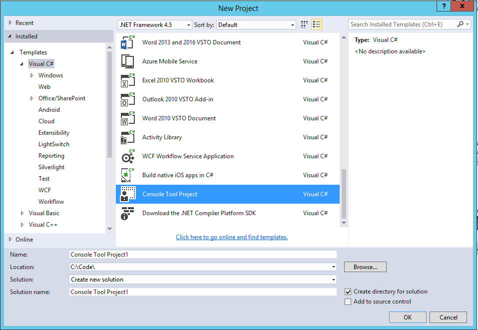

# Project Template

# Overview
Project Template is a console project template in visual studio, you can use it to create a console project in order to use common method like csv reader/writer/log/database and so on(Hope my continue).

# How to use it
Download the realase folder, you will see some `.zip` files and `.bat` files, double click the `.bat` file which depend on your visual studio version to install the template, and then, open your visual studio, you can see the templates in your New Project window.

If you can not install it successfully, you can copy the zip file to your VS template folder manually, generally, the folder path is: `Your Computer\Documents\Visual Studio 20xx\Templates\ProjectTemplates\Visual C#`, copy the file to this folder, and open your visual studio, you can see the templates in your New Project window. See below:

